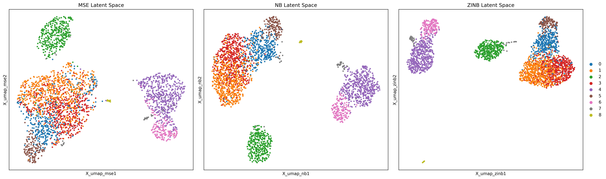

# scVAE Ablation: Modeling Zero-Inflation in scRNA-seq

This repository contains a Variational Autoencoder (VAE) built from scratch to analyze single-cell RNA sequencing (scRNA-seq) data. The project features an ablation study demonstrating why standard continuous loss functions fail on biological count data, and how specialized probabilistic distributions resolve these issues.

The models are trained and evaluated on the standard PBMC 3k dataset.

## The Ablation Study

Single-cell RNA sequencing data is highly sparse and zero-inflated (technical dropout). This project compares three different generative loss functions to evaluate their impact on the VAE's latent space:

1. **Mean Squared Error (MSE):** Assumes continuous, normally distributed data. Fails to account for discrete counts, resulting in collapsed, unseparated biological clusters.
2. **Negative Binomial (NB):** Models discrete count data, mathematically accounting for gene expression variance, but struggles with the extreme rate of technical zeros.
3. **Zero-Inflated Negative Binomial (ZINB):** Explicitly models both the count distribution and the zero-inflation probability ($\pi$), successfully disentangling technical noise from true biological signal.

### Results
The ZINB model achieves strictly superior biological clustering, isolating distinct immune subpopulations that standard models merge together. 



Quantitative evaluation confirms the visual findings:
* **Generative Performance:** ZINB actively denoises the expression matrix, accurately predicting true mean gene expression despite high sparsity.
* **Clustering Metrics:** ZINB achieves an Adjusted Rand Index (ARI) and Silhouette Score significantly higher than the continuous MSE baseline.

*(Note: Additional metric graphs including Sparsity Profiling, ARI scores, and Cluster Distance Heatmaps are available in the `visualization/` directory).*

## Repository Structure

* `data/`: Data loading and preprocessing scripts (`dataset.py`). Downloads the PBMC 3k dataset.
* `models/`: PyTorch definitions for the VAE architecture, layer blocks, and statistical distributions (`vae.py`, `distributions.py`).
* `scripts/`: Executable scripts for training and advanced metric calculations (`run_ablation.py`, `advanced_analysis.py`).
* `utils/`: Helper functions for UMAP generation and latent space evaluation (`evaluation.py`).
* `visualization/`: Contains all generated plots, heatmaps, and UMAPs.
* `checkpoints/`: Saved `.pt` state dictionaries for the trained models.

## Installation

Clone the repository and install the required dependencies:

```bash
git clone [https://github.com/yourusername/scvae_ablation.git](https://github.com/yourusername/scvae_ablation.git)
cd scvae_ablation
python3 -m venv venv
source venv/bin/activate  # On Windows use `venv\Scripts\activate`
pip install -r requirements.txt
```

## Usage
### 1. Train the Models
To train the MSE, NB, and ZINB models from scratch and save their weights to checkpoints/:

```
python -m scripts.run_ablation
```
### 2. Generate UMAP Visualizations
To load the frozen model weights and generate the baseline comparative UMAPs:
```
python3 -m utils.evaluation
```
### 3. Run Quantitative Analysis
To calculate ARI scores, Silhouette scores, generative reconstruction fidelity, and cluster distance heatmaps:
```
python scripts/quantitative_analysis.py
python -m scripts.advanced_analysis
```

## References

This project builds upon foundational concepts in single-cell transcriptomics and probabilistic deep learning.

1. **Dataset:** 10x Genomics. (2016). *3k PBMCs from a Healthy Donor*. Single Cell Gene Expression Dataset. Available at: [10xgenomics.com](https://www.10xgenomics.com/resources/datasets/3-k-pbm-cs-from-a-healthy-donor-1-standard-1-1-0)
2. **scVI Architecture:** Lopez, R., Regier, J., Cole, M. B., Jordan, M. I., & Yosef, N. (2018). *Deep generative modeling for single-cell transcriptomics*. Nature Methods, 15(12), 1053-1058. (Provides the foundational justification for using ZINB distributions in scRNA-seq VAEs).
3. **Scanpy:** Wolf, F. A., Angerer, P., & Theis, F. J. (2018). *SCANPY: large-scale single-cell gene expression data analysis*. Genome Biology, 19(1), 15.

## License

This project is licensed under the MIT License.